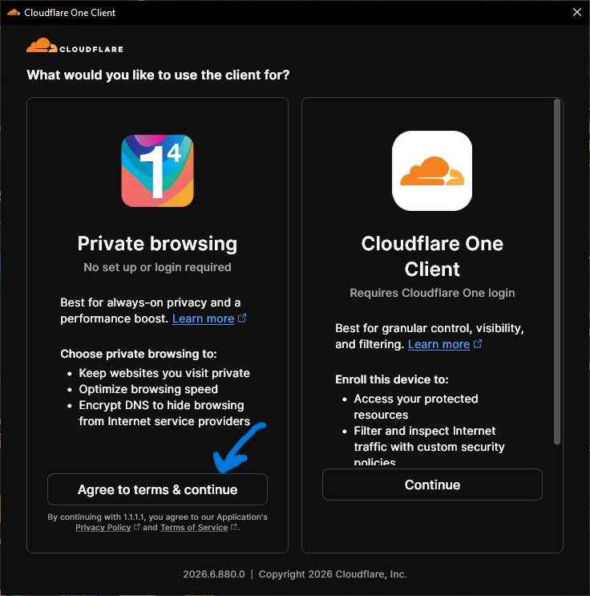

# 🔑 راهنمای دریافت Api_id و Api_hash تلگرام
این متن یه راهنمای کامل و گام‌به‌گام برای دریافت `api_id` و `api_hash` از سایت `my.telegram.org` مخصوص کاربران ایرانی هست.

---

## 📌 چرا این راهنما؟

اگر تا حالا خواسته‌اید ربات تلگرام بسازید یا از API تلگرام استفاده کنید، حتماً می‌دانید که به `api_id` و `api_hash` نیاز دارید. اما به دلیل محدودیت‌های اینترنتی و تحریمی، خیلی از کاربران ایرانی نمی‌توانند به راحتی این اطلاعات را دریافت کنند. این راهنما دقیقاً برای همین مشکل نوشته شده.

---

## 🛠 مراحل (گام‌به‌گام)

### 1️⃣ دانلود و نصب Cloudflare WARP

ابتدا باید نرم‌افزار WARP را نصب کنید تا بتوانید بدون وی‌پی‌ان و با آیپی ایران به سایت دسترسی داشته باشید.

#### برای ویندوز:
- به سایت [cloudflarewarp.com](https://cloudflarewarp.com) بروید.
- روی دکمه **Download** کلیک کنید.
- فایل نصب را اجرا کرده و مراحل را طی کنید.
- برنامه را باز کرده و کلید **Connect** را بزنید تا روشن شود.

📸 اسکرین‌شات 

 

  

---

#### برای اندروید:
- اپلیکیشن **1.1.1.1** را از [Google Play](https://play.google.com/store/apps/details?id=com.cloudflare.onedotonedotonedotone) دانلود کنید.
- نصب کرده و باز کنید.
- کلید **Connect** را بزنید.

📸 اسکرین‌شات 

 

  

---

### 2️⃣ باز کردن سایت my.telegram.org

مرورگر خود را باز کنید و آدرس زیر را وارد کنید:

> اگر سایت باز نشد، مطمئن شوید WARP روشن است.

---

### 3️⃣ وارد کردن شماره تلفن

- کد کشور `+98` (ایران) رو انتخاب کنید.
- شماره موبایل خود را **بدون صفر اول** وارد کنید (مثلاً `9121234567`).
- روی دکمه **Next** کلیک کنید.

---

### 4️⃣ دریافت و وارد کردن کد تایید

- یک کد ۵ رقمی به تلگرام شما پیامک خواهد شد.
- کد را در صفحه وارد کرده و روی **Sign In** کلیک کنید.

---

### 5️⃣ رفتن به بخش ساخت API

پس از ورود، روی لینک **API development tools** کلیک کنید.

---

### 6️⃣ ساخت اپلیکیشن جدید

- روی دکمه **Create new application** کلیک کنید.
- فرم را پر کنید:
  - `App title`: یک نام دلخواه (مثلاً `MyTelegramBot`)
  - `Short name`: یک نام کوتاه (مثلاً `mybot`)
  - `Description`: توضیحات (اختیاری)
- روی **Create application** کلیک کنید.

---

### 7️⃣ دریافت Api_id و Api_hash

حالا اطلاعات زیر را مشاهده خواهید کرد:

- **App api_id**: یک عدد (مثلاً `1234567`)
- **App api_hash**: یک رشته طولانی (مثلاً `a1b2c3d4e5f6...`)

این اطلاعات را در جای امنی ذخیره کنید.

---

### 8️⃣ خاموش کردن WARP

پس از دریافت اطلاعات، WARP را خاموش کنید.

- در ویندوز: کلید **Disconnect** را بزنید.
- در اندروید: کلید **Disconnect** را بزنید.

---

## ⚠️ نکات امنیتی

- `api_id` و `api_hash` خود را **هرگز با کسی به اشتراک نگذارید**.
- این اطلاعات مانند رمز عبور شما هستند و امکان سوءاستفاده از آنها وجود دارد.
- در صورت لو رفتن، می‌توانید از طریق همان سایت یک اپلیکیشن جدید بسازید و اطلاعات قبلی را غیرفعال کنید.

---

## ❓ سوالات متداول

### چرا با وی‌پی‌ان ارور می‌دهد؟
چون تلگرام کشور آیپی شما را با کشور شماره موبایل چک میکند. با WARP آیپی شما همچنان ایران باقی می‌ماند.

### آیا این روش قانونی است؟
بله، این روش صرفاً برای دور زدن محدودیت‌های تحریمی و دسترسی به سرویس رسمی تلگرام است.

### ارور `Too many attempts` گرفتم، چکار کنم؟
چند دقیقه صبر کنید و دوباره تلاش کنید.

---

## 📝 جمع‌بندی

| مرحله | توضیح |
|-------|-------|
| ۱ | نصب و روشن کردن WARP |
| ۲ | باز کردن my.telegram.org |
| ۳ | وارد کردن شماره تلفن |
| ۴ | دریافت کد تایید |
| ۵ | رفتن به API development tools |
| ۶ | ساخت اپلیکیشن جدید |
| ۷ | دریافت api_id و api_hash |
| ۸ | خاموش کردن WARP |

---

## 🤝 مشارکت

اگر پیشنهادی برای بهبود این راهنما دارید، خوشحال میشیم که Pull Request بدید یا Issue ثبت کنید.

---

**موفق باشید! 🚀**
